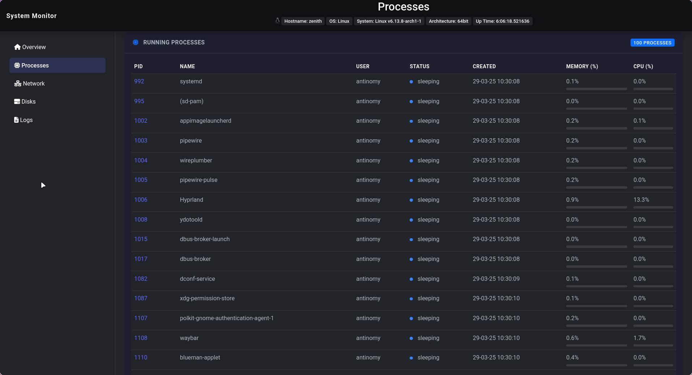
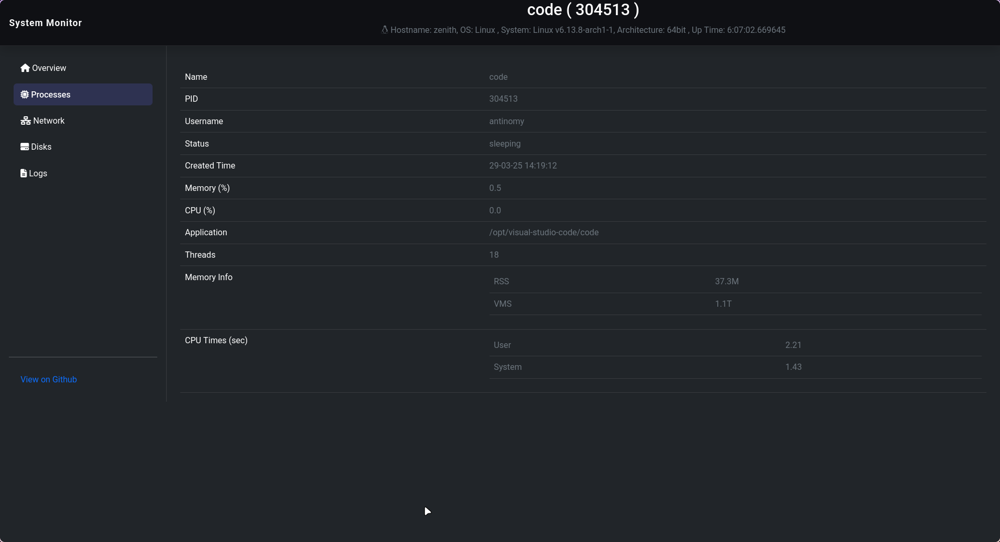

# PC Time Tracking

A powerful process monitoring and productivity tracking tool for Arch Linux with Hyprland integration, featuring detailed process analytics and system resource monitoring.

## Process Monitoring Dashboard

### Process Overview

The main dashboard provides real-time monitoring of system processes with:
- Process list with CPU and memory usage
- System resource utilization
- Active processes sorting and filtering

### Process Details

Detailed process view includes:
- In-depth process statistics
- Resource usage history
- Process-specific metrics

## Core Features

### System Monitoring
- Real-time process tracking with psutil
- CPU and memory usage analytics
- Process lifecycle management
- System resource monitoring

### Hyprland Integration
- Window focus tracking
- Workspace activity monitoring
- Application usage statistics

### Data Management
- PostgreSQL database (pc_tracking)
- Process history logging
- Activity timeline tracking
- Work session analytics

## Technical Requirements

- Arch Linux
- Hyprland window manager
- PostgreSQL database
- Python 3.x
- psutil, psycopg2, blessed libraries

## Usage

### Controls
- `q`: Exit application
- `r`: Refresh process list
- `s`: Toggle summary view

### Configuration
- Process monitoring interval: 1.0s
- Idle detection threshold: 300s
- Database user: aura

## Database Schema

- Processes: System process metrics and states
- WorkSessions: Productivity tracking periods
- ActivityTimeline: Detailed system activity logs
