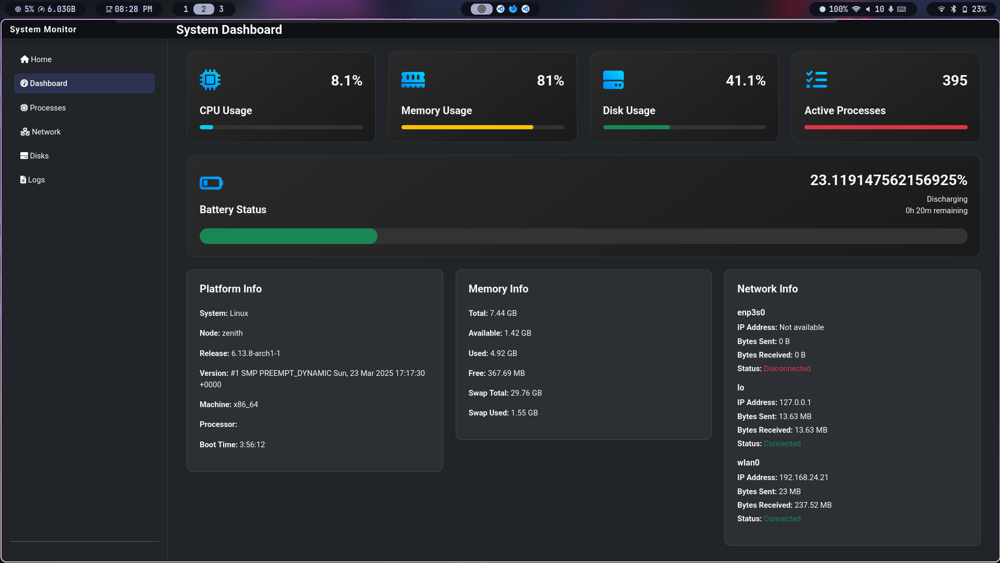
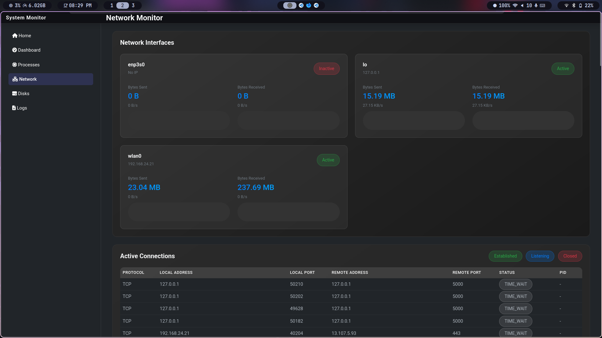
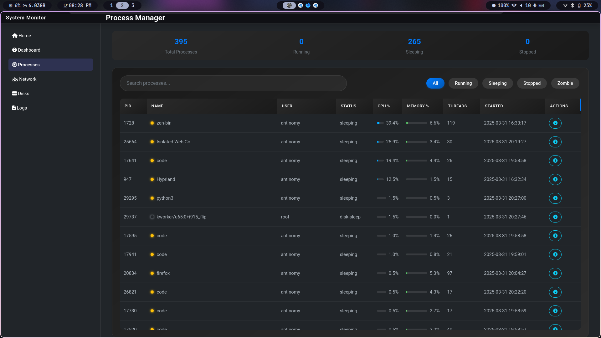
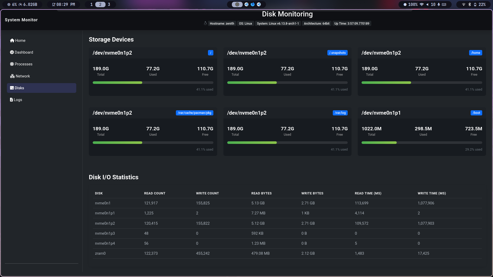

# PC Time Tracking

A web-based system monitoring dashboard for Arch Linux that tracks processes, system resources, and productivity metrics.

## Screenshots

### Dashboard Overview



### Netework Details



### Process Details



### Disk Details



## Quick Start

### Prerequisites

- Arch Linux
- Python 3.x

### Installation

```bash
# Clone the repository
git clone https://github.com/KIRIN-9/PC-Time-Tracking.git
cd PC-Time-Tracking

# Create and activate virtual environment
python -m venv venv
source venv/bin/activate

# Install dependencies
pip install -r requirements.txt
```

### Running the Application

```bash
# Start the web server
python run.py
```

Open your browser and navigate to `http://localhost:5000`

## Features

- Real-time process monitoring
- System resource tracking
- Process details and statistics
- Clean, responsive web interface
